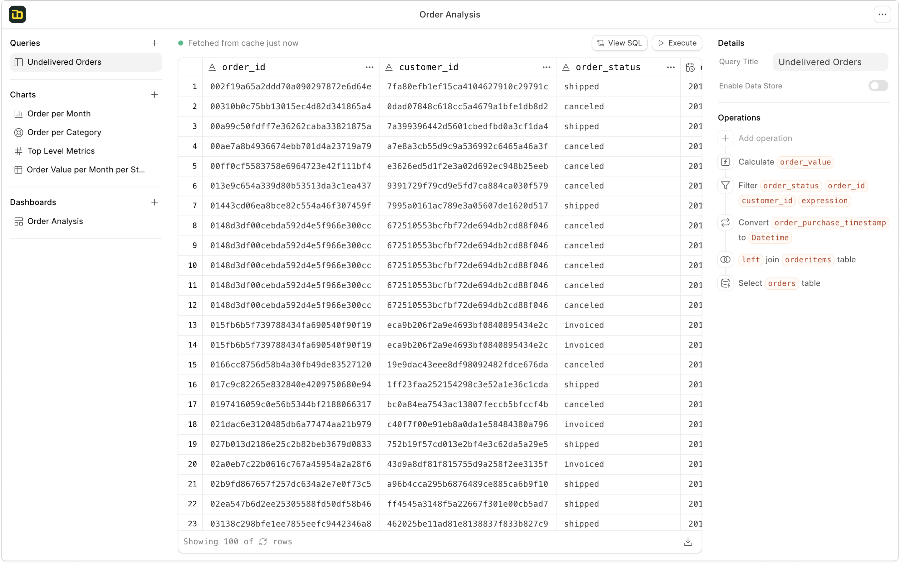
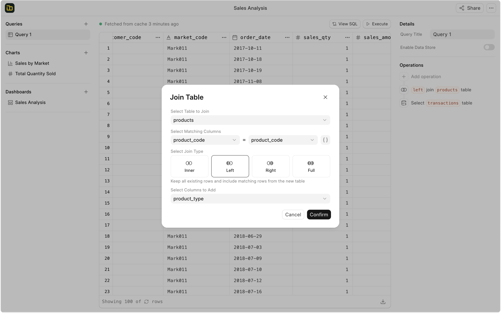
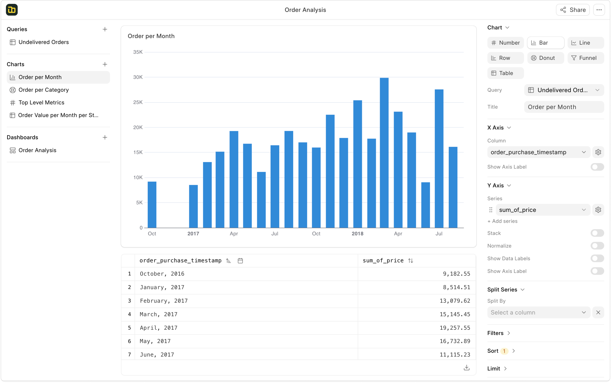

<div align="center" markdown="1">


<h1>Frappe Insights</h1>

**Open Source Business Intelligence Tool**


[](https://codecov.io/github/frappe/insights)

</div>


<div align="center">
	
</div>
<br />
<div align="center">
    <a href="https://insightsdemo.frappe.cloud">Live Demo</a>
    -
    <a href="https://frappe.io/insights">Website</a>
    -
    <a href="https://docs.frappe.io/insights">Documentation</a>
</div>

## Frappe Insights
Insights is a 100% open-source BI tool designed to make data analysis and reporting more accessible to technical as well as non-technical users.

<details>
<summary>Screenshots</summary>




</details>

### Motivation
Building custom apps or creating structured data has been very easy with Frappe Framework. However, extracting information from these apps was not a very good experience. Users needed to know how to write SQL queries to create reports to gain valuable information from the data. So I wanted to improve the experience of building these reports and dashboards for everyone in our team.

### Key Features

- **Connect Multiple Sources**: You can integrate data from multiple databases, files and spreadsheets. Getting all your data into one place helps you analyse interconnected data.

- **Query Builder**: You can use the query builder to create queries without any SQL knowledge. The interface provides a step-by-step approach for building queries, allowing users to easily select tables, add joins, apply filters, perform calculations, and more.

- **Visualizations and Dashboards**: You can visualize the query results using a variety of charts and graphs. Frappe Insights also suggests the best chart for a given result set. You can create dashboards using a drag-and-drop interface and add filters on the dashboard to apply to the charts.

- **Database Support**: Frappe Insights currently supports MySQL, PostgreSQL, DuckDB, and BigQuery databases. More database integrations are planned for the future.


### Under the Hood

- [**Frappe Framework**](https://github.com/frappe/frappe): A full-stack web application framework.

- [**Frappe UI**](https://github.com/frappe/frappe-ui): A Vue-based UI library, to provide a modern user interface.

- [**Ibis**](https://github.com/ibis-project/ibis): A powerful library to compose SQL queries with dataframe APIs.

- [**eCharts**](https://github.com/apache/echarts): An interactive charting and data visualization library.


## Production Setup

### Managed Hosting

You can try [Frappe Cloud](https://frappecloud.com), a simple, user-friendly and sophisticated [open-source](https://github.com/frappe/press) platform to host Frappe applications with peace of mind.

It takes care of installation, setup, upgrades, monitoring, maintenance and support of your Frappe deployments. It is a fully featured developer platform with an ability to manage and control multiple Frappe deployments.

<div>
    <a href="https://frappecloud.com/insights/signup" target="_blank">
        <picture>
            <source media="(prefers-color-scheme: dark)" srcset="https://frappe.io/files/try-on-fc-white.png">
            
        </picture>
    </a>
</div>

### Self Hosting

Follow these steps to set up Frappe Insights in production:

**Step 1**: Download the easy install script

```bash
wget https://frappe.io/easy-install.py
```

**Step 2**: Run the deployment command

```bash
python3 ./easy-install.py deploy \
    --project=insights_prod_setup \
    --email=your_email.example.com \
    --image=ghcr.io/frappe/insights \
    --version=stable \
    --app=insights \
    --sitename subdomain.domain.tld
```

Replace the following parameters with your values:
- `your_email.example.com`: Your email address
- `subdomain.domain.tld`: Your domain name where Insights will be hosted

**Step 3**: Enable Server Scripts

```bash
docker compose -p insights_prod_setup exec backend bench set-config -g server_script_enabled 1
```

**Step 4**: Access the site

Open the site in your browser at `https://subdomain.domain.tld/` and login with the administrator credentials. You will find the admin password logged in the console after the deployment command is finished. Or you can find it in the `insights_prod_setup-passwords.txt` file created after the deployment.

## Development Setup

### Docker

You need Docker, docker-compose and git setup on your machine. Refer [Docker documentation](https://docs.docker.com/). After that, follow below steps:

1. Setup folder and download the required files
    ````
    mkdir frappe-insights
    cd frappe-insights

    # Download the docker-compose file
    wget -O docker-compose.yml https://raw.githubusercontent.com/frappe/insights/develop/docker/docker-compose.yml

    # Download the setup script
    wget -O init.sh https://raw.githubusercontent.com/frappe/insights/develop/docker/init.sh
    ````

2. Run the container and daemonize it
    ````
    docker compose up -d
    ````

3. The site [http://insights.localhost:8000/insights](http://insights.localhost:8000/insights) should now be available. The default credentials are:
   - Username: Administrator
   - Password: admin
  
4. If you need to stop the containers after use and persist the data
   ````
   docker compose stop
   ````

5. If you need to stop the containers cleanup entire setup after trying it out
   ````
   docker compose down
   ````
### Local

To setup the repository locally follow the steps mentioned below:

1. Setup bench by following the [Installation Steps](https://frappeframework.com/docs/user/en/installation) and start the server
    ```
    bench start
    ```

2. In a separate terminal window, cd into `frappe-bench` directory and run the following commands:
    ```sh
    bench get-app insights
    bench new-site insights.test --install-app insights
    bench --site insights.test add-to-hosts
    bench --site insights.test browse --user Administrator
    ```

3. Now, open a new terminal session and cd into `frappe-bench/apps/insights`, and run the following commands:
    ```
    yarn
    yarn dev
    ```

4. Now, you can access the site on vite dev server at `http://insights.test:8080`


## Learn and connect

- [Telegram Public Group](https://t.me/frappeinsights)
- [Discuss Forum](https://discuss.frappe.io/c/insights/74)
- [Documentation](https://docs.frappe.io/insights)
- [YouTube](https://www.youtube.com/@frappetech)


<br>
<br>
<div align="center" style="padding-top: 0.75rem;">
    <a href="https://frappe.io" target="_blank">
        <picture>
            <source media="(prefers-color-scheme: dark)" srcset="https://frappe.io/files/Frappe-white.png">
            
        </picture>
    </a>
</div>
