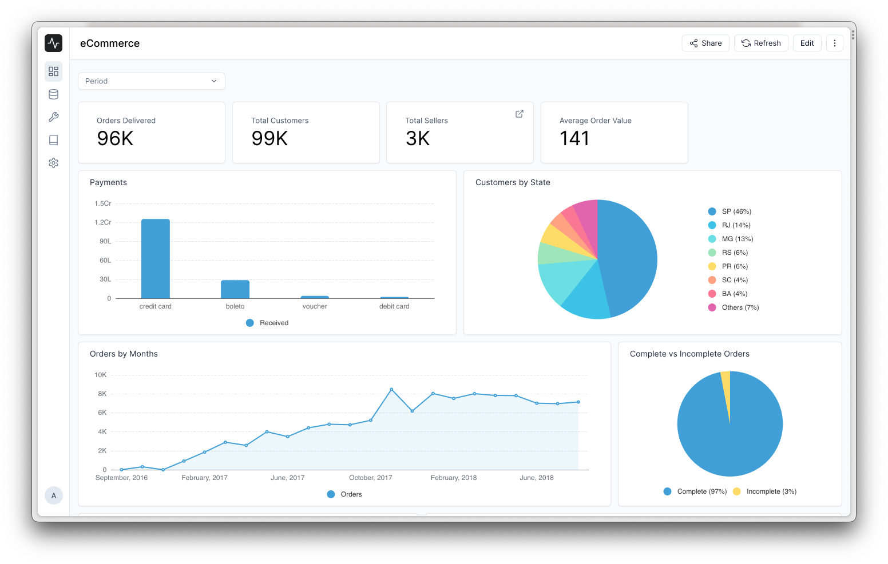

<div align="center" markdown="1">


<h1>Frappe Insights</h1>

**Simple. Crafted. Powerful. Data Analysis.**


[](https://codecov.io/github/frappe/insights)
[](https://github.com/frappe/insights/actions/workflows/server-tests.yml)

</div>

<div align="center" style="max-height: 40px;">
	<a href="https://frappecloud.com/insights/signup">
		
	</a>
</div>

<div align="center" style="padding-top: 1rem; padding-bottom: 1rem; display: flex; justify-content:center;">
	
</div>

<div align="center" style="padding-top: 1rem; padding-bottom: 1rem; display: flex; justify-content:center;">
	<a href="https://insights-demo.frappe.cloud">Live Demo</a>
	-
	<a href="https://docs.frappeinsights.com">Documentation</a>
</div>

## Introduction
Frappe Insights is an open-source project designed to simplify data analysis and reporting from databases. Built upon the Frappe Framework, Frappe Insights aims to provide an intuitive interface that enables users to effortlessly generate complex reports and gain valuable insights from their data.


## Motivation
The inspiration behind Frappe Insights was the need to simplify data analysis for the apps built upon Frappe Framework. While the framework provides robust tools for managing structured data using DocTypes, analyzing and visualizing that data often requires developer expertise. Frappe Insights aims to bridge this gap by offering a user-friendly solution that empowers non-technical users to perform data analysis tasks without relying on developers.

## Key Features

**Query Builder**: Frappe Insights offers a user-friendly query builder interface that allows users to create database queries without the need for extensive SQL knowledge. The interface provides a step-by-step approach for building queries, empowering users to easily select tables, apply filters, perform calculations, and more.

**Visualizations and Dashboards**: Once a query is created, Frappe Insights enables users to visualize the results using a variety of charts and graphs. Users can easily create custom dashboards by combining multiple visualizations to gain a comprehensive view of their data.

**Connectivity**: Frappe Insights currently supports integration with MySQL databases, allowing users to connect to their existing databases and work directly with their data. More database integrations are planned for the future.

## Under the Hood

[**Frappe Framework**](https://github.com/frappe/frappe): Frappe Insights is built upon the Frappe Framework, a full-stack web application framework written in Python and Javascript. The framework provides a robust foundation for building web applications, including a database abstraction layer, user authentication, and a REST API.

[**Frappe UI**](https://github.com/frappe/frappe-ui): Frappe Insights uses the Frappe UI, a Vue-based UI library, to provide a modern and responsive user interface. The Frappe UI library provides a variety of components that can be used to build single-page applications on top of the Frappe Framework.

[**SQLAlchemy**](https://github.com/sqlalchemy/sqlalchemy): Frappe Insights uses SQLAlchemy, a Python SQL toolkit and Object Relational Mapper, to interact with the database. SQLAlchemy provides a powerful and flexible interface for working with databases, allowing Frappe Insights to support multiple database integrations.

[**eCharts**](https://github.com/apache/echarts): Frappe Insights uses eCharts, a powerful open-source charting and visualization library, to render charts and graphs. eCharts provides a variety of chart types and customization options, allowing Frappe Insights to provide a rich and interactive data visualization experience.

[**Pandas**](https://github.com/pandas-dev/pandas): Frappe Insights uses Pandas, a Python data analysis library, to perform data analysis tasks. Pandas provides a variety of data structures and functions for working with structured data, allowing Frappe Insights to provide powerful data analysis capabilities.


## Installation
### Docker
You need Docker, docker-compose and git setup on your machine. Refer [Docker documentation](https://docs.docker.com/). After that, run the following commands:

```
git clone https://github.com/frappe/insights
cd insights/docker
docker-compose up
```

Wait for sometime until the setup script creates a site. After that you can
Open the URL `http://insights.localhost:8000/insights` in your browser, you should see the app running
should show up. You can login with the default credentials `Administrator` and `admin`.

### Local

To setup the repository locally follow the steps mentioned below:

1. Install bench and setup a `frappe-bench` directory by following the [Installation Steps](https://frappeframework.com/docs/user/en/installation)
1. Start the server by running `bench start`
1. In a separate terminal window, create a new site by running `bench new-site insights.test`
1. Map your site to localhost with the command `bench --site insights.test add-to-hosts`
1. Get the Insights app. Run `bench get-app https://github.com/frappe/insights`
1. Run `bench --site insights.test install-app insights`.
1. Now open the URL `http://insights.test:8000/insights` in your browser, you should see the app running

---
## Contributions and Community

There are many ways you can contribute even if you don't code:

1. You can start by giving a star to this repository!
1. If you find any issues, even if it is a typo, you can [raise an issue](https://github.com/frappe/insights/issues/new) to inform us.
1. You can join our [telegram group](https://t.me/frappeinsights) and share your thoughts.

---

## License

[GNU Affero General Public License v3.0](license.txt)
