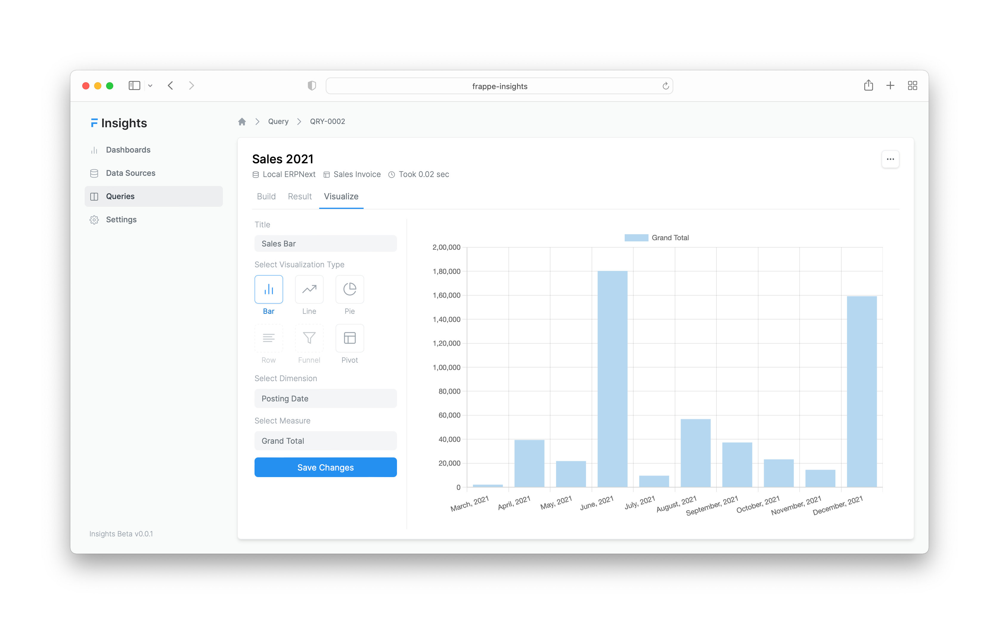

**Free and Open Source Data Analytics Tool for your Frappe Apps**

---

## Preview

### Query

### Result

### Visualize

---

## Installation

### Local

To setup the repository locally follow the steps mentioned below:

1. Install bench and setup a `frappe-bench` directory by following the [Installation Steps](https://frappeframework.com/docs/user/en/installation)
1. Start the server by running `bench start`
1. In a separate terminal window, create a new site by running `bench new-site insights.test`
1. Map your site to localhost with the command `bench --site insights.test add-to-hosts`
1. Get the Insights app. Run `bench get-app https://github.com/frappe/insights`
1. Run `bench --site insights.test install-app insights`.
1. Now open the URL `http://insights.test:8000/insights` in your browser, you should see the app running

---
## Contributions and Community

There are many ways you can contribute even if you don't code:

1. You can start by giving a star to this repository!
1. If you find any issues, even if it is a typo, you can [raise an issue](https://github.com/frappe/insights/issues/new) to inform us.
1. You can join our [telegram group](https://t.me/frappeinsights) and share your thoughts.

---

## License

[GNU Affero General Public License v3.0](license.txt)
